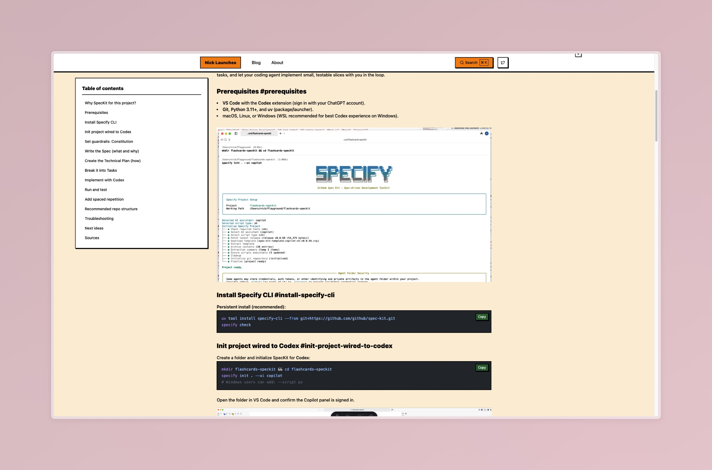

# Flashcards App with Speckit

[](https://nicklaunches.com/blog/build-flashcards-app-github-speckit-vscode-codex-tutorial)

> **📚 Check out the [full tutorial](https://nicklaunches.com/blog/build-flashcards-app-github-speckit-vscode-codex-tutorial) to learn how this app was built!**

A modern flashcards application built with Next.js, TypeScript, and SQLite, demonstrating specification-driven development with GitHub Speckit and VS Code Codex.

## Features

- 📝 Create and manage decks of flashcards
- 🎯 Study mode with spaced repetition
- 📊 Track your learning progress
- 💾 Local SQLite database for data persistence
- 🎨 Clean, responsive UI with Tailwind CSS
- ⚡ Built with Next.js 14+ App Router for optimal performance

## Tech Stack

- **Frontend**: React 18+, Next.js 14+ (App Router)
- **Language**: TypeScript 5+
- **Database**: SQLite3 with Drizzle ORM
- **Styling**: Tailwind CSS
- **Development**: Specification-driven with GitHub Speckit

## Getting Started

### Prerequisites

- Node.js 18+ installed
- Git (with your GitHub/ChatGPT account)
- macOS, Linux, or Windows (WSL recommended for best experience)

### Installation

1. Clone the repository:
```bash
git clone <your-repo-url>
cd flashcards-speckit
```

2. Install dependencies:
```bash
npm install
```

3. Initialize the database:
```bash
npm run db:push
```

4. Run the development server:
```bash
npm run dev
```

5. Open [http://localhost:3000](http://localhost:3000) in your browser

## Available Commands

- `npm run dev` - Start development server
- `npm run build` - Build for production
- `npm run start` - Start production server
- `npm test` - Run tests
- `npm run lint` - Lint code
- `npm run db:push` - Push database schema changes
- `npm run db:studio` - Open Drizzle Studio (database GUI)

## Project Structure

```
src/
├── app/              # Next.js App Router pages
├── components/       # React components
│   ├── card/        # Card-related components
│   ├── deck/        # Deck-related components
│   ├── study/       # Study mode components
│   └── ui/          # Reusable UI components
├── db/              # Database schema
├── lib/             # Utilities and repositories
│   ├── db/          # Database repositories
│   └── utils/       # Helper functions
└── types/           # TypeScript type definitions

specs/               # Speckit specifications
└── 001-flashcards-app/
```

## How It Was Built

This project was built using specification-driven development with:

- **[GitHub Speckit](https://github.com/features/copilot)** - For creating detailed specifications
- **[VS Code Codex](https://code.visualstudio.com/)** - For AI-assisted development

The entire development process is documented in the tutorial linked at the top of this README. You'll learn how to:

1. Set up Speckit for your project
2. Write effective specifications
3. Use AI to implement features from specs
4. Build a full-stack application iteratively

## Learn More

- 📖 [Full Tutorial](https://nicklaunches.com/blog/build-flashcards-app-github-speckit-vscode-codex-tutorial)
- 🌐 [Nick Launches - Website](https://nicklaunches.com)
- 🐦 [Follow on X/Twitter](https://x.com/nicklaunches)

## License

MIT License - feel free to use this project for learning and building your own applications!

## Contributing

Contributions, issues, and feature requests are welcome! Feel free to check the issues page.

---

Built with ❤️ using GitHub Speckit and VS Code Codex by [Nick Launches](https://nicklaunches.com)
